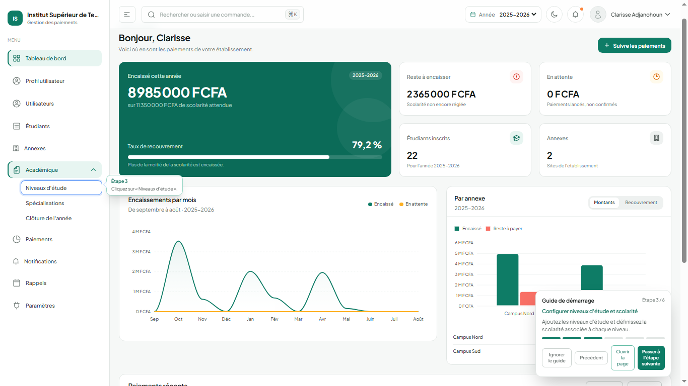
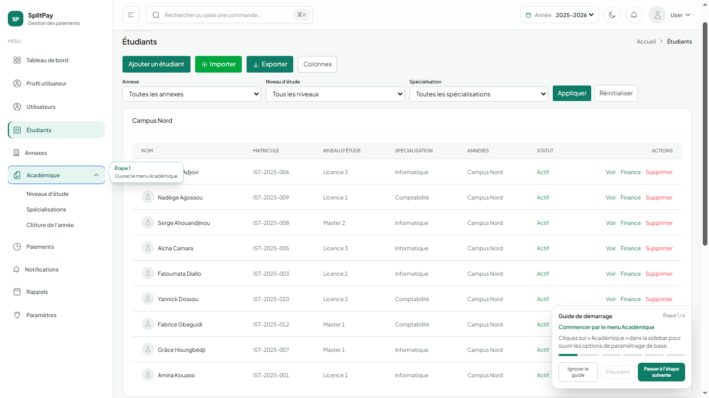
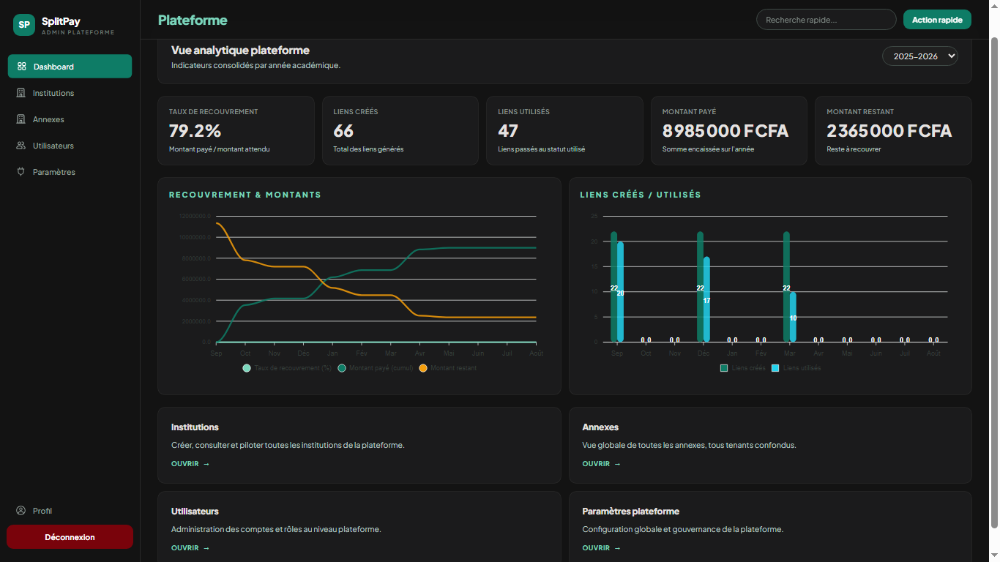
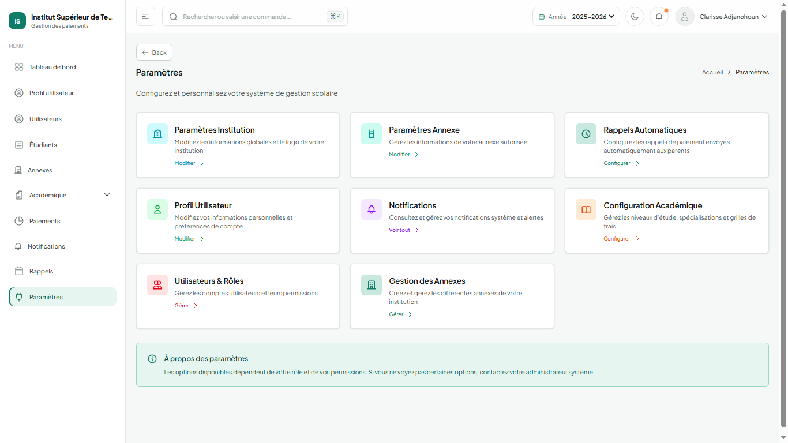
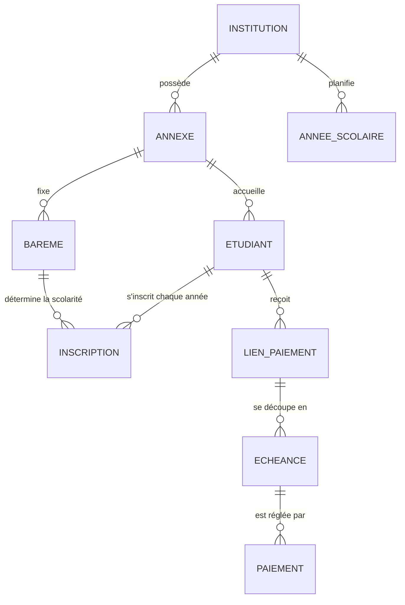

# SplitPay

SplitPay est une application web qui aide les écoles à encaisser et à suivre les frais de scolarité payés par Mobile Money.

Dans beaucoup d'établissements, le suivi des paiements se fait encore à la main : reçus papier, fichiers Excel, relances par téléphone. Les familles paient souvent en plusieurs fois, et il devient difficile de savoir qui a payé quoi. SplitPay centralise tout. L'école envoie un lien de paiement, le payeur règle depuis son téléphone (MTN ou Moov), et le paiement apparaît tout de suite dans les indicateurs de l'école.

## Aperçu

**Tableau de bord de l'établissement** : montant encaissé, reste à encaisser, taux de recouvrement, encaissements par mois et par site.



**Liste des étudiants** : matricule, niveau, filière et site de rattachement, avec un accès direct au suivi financier de chacun.



**Vue consolidée de la plateforme** : recouvrement et liens de paiement sur l'année, tous établissements confondus.



**Paramétrage de l'établissement** : informations de l'institution et des annexes, utilisateurs et rôles, niveaux d'étude et barèmes, rappels automatiques.



## Ce que fait l'application

**Pour l'administration de l'école**

- gérer les étudiants, leur niveau, leur filière et leur inscription de l'année ;
- définir les frais de scolarité par niveau et par filière ;
- envoyer des liens de paiement, à un étudiant ou à toute une promotion ;
- suivre les paiements reçus et ce qui reste à payer ;
- relancer automatiquement par e-mail avant chaque échéance ;
- clôturer l'année scolaire et faire passer les étudiants au niveau suivant.

**Pour la personne qui paie**

- ouvrir le lien reçu, sans créer de compte ;
- payer tout ou partie du montant avec MTN ou Moov ;
- revenir plus tard pour payer le reste.

**Pour l'étudiant**

- se connecter avec son matricule et un code reçu par e-mail ;
- voir ce qu'il a payé, ce qu'il doit encore et l'historique de ses paiements.

Une même installation peut accueillir plusieurs écoles, et chaque école peut avoir plusieurs sites (annexes). Chaque école ne voit que ses propres données. À l'intérieur d'une école, chaque membre de l'équipe a un rôle (direction, gestionnaire, comptable) qui limite ce qu'il peut voir et faire.

## Démarche

J'ai mené le projet de bout en bout, de l'analyse du besoin jusqu'aux tests :

1. **Analyse du besoin** : comment une école encaisse aujourd'hui, qui intervient (direction, comptabilité, familles, étudiants), où se perdent les informations.
2. **Spécifications fonctionnelles** : acteurs, cas d'usage et règles de gestion, décrits dans [docs/01-specifications-fonctionnelles.md](docs/01-specifications-fonctionnelles.md).
3. **Modèle de données** avec la méthode Merise (MCD puis MLD) : [docs/02-schema-merise.md](docs/02-schema-merise.md).
4. **Développement** de l'application web et de l'intégration du paiement Mobile Money.
5. **Plan de tests** : chaque fonctionnalité a ses cas de test et ses résultats attendus ([docs/03-plan-de-tests.md](docs/03-plan-de-tests.md)), dont une partie est automatisée.
6. **Test avec un établissement**, pour confronter l'application à un fonctionnement réel.

## Indicateurs de pilotage

Le tableau de bord donne à la direction de quoi piloter les encaissements sur l'année scolaire :

| Indicateur | Calcul |
|---|---|
| Montant encaissé | Somme des paiements confirmés sur l'année |
| Reste à encaisser | Scolarité attendue moins scolarité réglée |
| Taux de recouvrement | Scolarité réglée / scolarité attendue |
| Encaissements par mois | Paiements confirmés regroupés de septembre à août |
| Comparaison des sites | Encaissé, reste à payer et taux de recouvrement par annexe |
| Paiements en attente | Paiements lancés mais pas encore confirmés par l'opérateur |

## Règles de gestion importantes

- **La scolarité se paie en plusieurs fois.** Chaque lien de paiement correspond à une tranche (par exemple 40 % en octobre, 30 % en janvier, 30 % en avril), et chaque tranche peut elle-même être réglée en plusieurs paiements partiels.
- **Un montant payé n'est jamais saisi à la main.** Il est toujours recalculé à partir des paiements réellement confirmés, ce qui garde les soldes justes même si un paiement est corrigé ou signalé deux fois.
- **Un paiement n'est validé que s'il est confirmé par l'opérateur.** L'application redemande toujours le statut réel à la passerelle de paiement, au lieu de croire le message reçu.
- **Une année clôturée reste consultable mais ne peut plus être modifiée.** La clôture fait passer chaque étudiant au niveau suivant, avec le tarif de la nouvelle année.
- **Chaque école est isolée des autres.** Toutes les écoles partagent la même base, et chaque requête est filtrée selon l'école et les sites de l'utilisateur connecté.

## Modèle de données

Version simplifiée du modèle conceptuel. Le MCD et le MLD complets sont dans [docs/02-schema-merise.md](docs/02-schema-merise.md).



## Technologies

- **Application** : Laravel 12 (PHP), API REST, interface en Vue 3 et Tailwind CSS, graphiques ApexCharts
- **Base de données** : MySQL 8 ou MariaDB
- **Paiement** : PayPlus (Mobile Money MTN et Moov)
- **Tâches automatiques** : relances par e-mail et alertes d'échéance (scheduler Laravel)
- **Déploiement** : Docker (PHP-FPM, Nginx, MySQL, Redis)

## Lancer le projet en local

Il faut PHP 8.2 ou plus, Composer, Node.js 20 ou plus et MySQL (ou MariaDB, par exemple avec XAMPP).

```bash
git clone https://github.com/Rock49899/SplitPay.git
cd SplitPay

composer install
npm install
npm run build

cp .env.example .env
php artisan key:generate
```

Créez une base de données vide nommée `splitpay`, et vérifiez les accès MySQL dans le fichier `.env` (`DB_USERNAME`, `DB_PASSWORD`). Ensuite :

```bash
php artisan migrate --seed
php artisan storage:link
composer serve
```

L'application est disponible sur http://127.0.0.1:8001. La commande `--seed` crée un établissement de démonstration avec deux sites, deux années scolaires et un historique de paiements.

**Comptes de démonstration** (mot de passe : `password`) :

| Compte | Rôle |
|---|---|
| admin@ist-edu.com | Direction de l'établissement (les deux sites) |
| marie@ist-edu.com | Gestionnaire du Campus Nord |
| platform@splitpay.test | Administration de la plateforme |

Pour tester de vrais paiements, il faut un compte PayPlus et remplir les variables `PAYPLUS_*` du fichier `.env`. Sans ces clés, tout le reste de l'application fonctionne.

## Tests

```bash
php artisan test
```

Les tests utilisent une base MySQL séparée, `scolarity_pay_test`, à créer avant le premier lancement.

## Documentation

- [Spécifications fonctionnelles](docs/01-specifications-fonctionnelles.md) : les utilisateurs, les cas d'usage et les règles de gestion
- [Schéma de la base de données (Merise)](docs/02-schema-merise.md) : MCD et MLD
- [Plan de tests](docs/03-plan-de-tests.md) : les cas vérifiés pour chaque fonctionnalité

## Auteur

Projet réalisé par [Rock49899](https://github.com/Rock49899).
