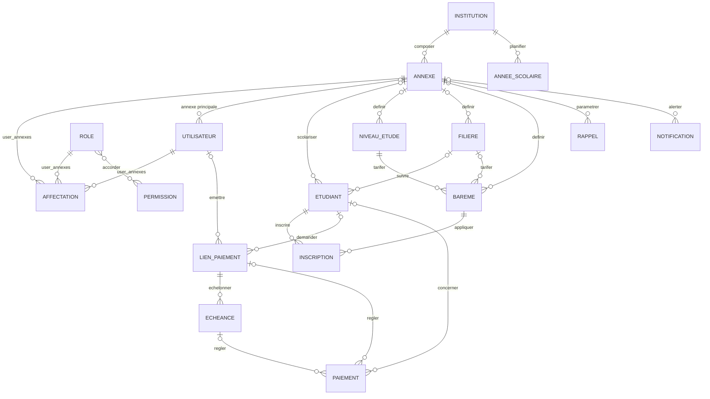

# Schéma Merise — SplitPay (MCD et MLD)

> Établi à partir de l'état final des migrations (`database/migrations`) et des modèles Eloquent (`app/Models`).
> Les tables techniques du framework sont exclues du modèle métier : `sessions`, `password_reset_tokens`,
> `cache`, `cache_locks`, `jobs`, `job_batches`, `failed_jobs`, `personal_access_tokens`.

## 1. Dictionnaire des entités

| Entité (MCD) | Table (MLD) | Rôle |
|---|---|---|
| INSTITUTION | `institutions` | Établissement client (tenant) |
| ANNEXE | `annexes` | Site / campus d'une institution |
| UTILISATEUR | `users` | Compte d'administration |
| ROLE | `roles` | Profil de droits (`platform_admin`, `super_admin_institution`, `super_admin_annexe`, `gestionnaire`, `comptable`) |
| PERMISSION | `permissions` | Droit élémentaire (`student.view`, `payment.manage`…) |
| ETUDIANT | `students` | Apprenant d'une annexe |
| NIVEAU_ETUDE | `study_levels` | Niveau (L1, L2…) avec ordre de progression |
| FILIERE | `specializations` | Spécialité (Informatique, Gestion…) |
| BAREME | `level_fees` | Montant de scolarité pour niveau + filière + année |
| INSCRIPTION | `enrollments` | Inscription annuelle d'un étudiant, avec suivi du payé |
| ANNEE_SCOLAIRE | `school_years` | Calendrier scolaire d'une institution |
| LIEN_PAIEMENT | `payment_links` | Demande de paiement publique (token) |
| ECHEANCE | `installments` | Tranche d'un lien de paiement |
| PAIEMENT | `payments` | Transaction Mobile Money |
| RAPPEL | `reminders` | Règle de relance « N jours avant échéance » |
| NOTIFICATION | `notifications` | Alerte interne d'une annexe |

## 2. Modèle Conceptuel de Données (MCD)

### 2.1 Entités et propriétés

L'identifiant est souligné.

- **INSTITUTION** (<u>id</u>, nom, email, téléphone, adresse, ville, logo, est_active)
- **ANNEXE** (<u>id</u>, nom, adresse, ville, détails [JSON : email, téléphone, fax, site web], est_active)
- **UTILISATEUR** (<u>id</u>, nom, email, avatar, mot_de_passe, téléphone, est_actif, périmètre [platform | institution | annexe], email_vérifié_le)
- **ROLE** (<u>id</u>, code, libellé, description, périmètre [platform | institution | annexe])
- **PERMISSION** (<u>id</u>, code, libellé, description, module)
- **ETUDIANT** (<u>id</u>, matricule, prénom, nom, email, téléphone, avatar, statut [active | suspended | graduated])
- **NIVEAU_ETUDE** (<u>id</u>, code, ordre, libellé, description)
- **FILIERE** (<u>id</u>, code, libellé, description)
- **BAREME** (<u>id</u>, année_scolaire, montant_scolarité, notes)
- **INSCRIPTION** (<u>id</u>, année_scolaire, montant_scolarité, montant_payé, statut [active | completed | abandoned], promu_le, notes)
- **ANNEE_SCOLAIRE** (<u>id</u>, année, statut [draft | active | closed], ouverte_le, clôturée_le, promue_vers)
- **LIEN_PAIEMENT** (<u>id</u>, année_scolaire, type, devise, token, montant, description, date_échéance, statut [active | used | expired], envoyé_le, expire_le, créé_le)
- **ECHEANCE** (<u>id</u>, numéro_tranche, description, montant, date_échéance, montant_payé, statut [active | used | expired], créée_le, dernière_relance_le, nombre_relances)
- **PAIEMENT** (<u>id</u>, référence, montant, méthode, métadonnées, statut [pending | success | failed], id_transaction_payplus, nom_payeur, email_payeur, téléphone_payeur, payé_le)
- **RAPPEL** (<u>id</u>, jours_avant, message, est_actif)
- **NOTIFICATION** (<u>id</u>, titre, message, type, est_lue)

### 2.2 Associations et cardinalités

Notation Merise : `(min,max)` côté de chaque entité participante.

| Association | Entité A (card.) | Entité B (card.) | Propriétés portées | Lecture |
|---|---|---|---|---|
| COMPOSER | INSTITUTION (0,n) | ANNEXE (1,1) | — | Une annexe appartient à une seule institution. |
| AFFECTER *(ternaire)* | UTILISATEUR (0,n) — ANNEXE (0,n) | ROLE (0,n) | est_principale, affecté_le, fin_le | Un utilisateur reçoit un rôle sur une annexe. |
| ATTRIBUER_PAR | AFFECTER (0,1) | UTILISATEUR (0,n) | — | Auteur d'une affectation. |
| RATTACHER_PRINCIPALE | UTILISATEUR (0,1) | ANNEXE (0,n) | — | Annexe principale de l'utilisateur. |
| ACCORDER | ROLE (0,n) | PERMISSION (0,n) | — | Permissions d'un rôle. |
| SCOLARISER | ETUDIANT (0,1) | ANNEXE (0,n) | — | Annexe de l'étudiant (nullable en base). |
| SUIVRE | ETUDIANT (0,1) | FILIERE (0,n) | — | Filière de l'étudiant. |
| DEFINIR_NIVEAU | NIVEAU_ETUDE (0,1) | ANNEXE (0,n) | — | Catalogue propre à l'annexe. |
| DEFINIR_FILIERE | FILIERE (0,1) | ANNEXE (0,n) | — | Catalogue propre à l'annexe. |
| DEFINIR_BAREME | BAREME (0,1) | ANNEXE (0,n) | — | Barème propre à l'annexe. |
| TARIFER_NIVEAU | BAREME (1,1) | NIVEAU_ETUDE (0,n) | — | Un barème concerne un niveau. |
| TARIFER_FILIERE | BAREME (0,1) | FILIERE (0,n) | — | Sans filière = tarif générique du niveau. |
| INSCRIRE | INSCRIPTION (1,1) | ETUDIANT (0,n) | — | Une inscription par étudiant et par année. |
| APPLIQUER | INSCRIPTION (1,1) | BAREME (0,n) | — | Barème utilisé (montant figé dans l'inscription). |
| PLANIFIER | ANNEE_SCOLAIRE (0,1)* | INSTITUTION (0,n) | — | Calendrier de l'institution. |
| DEMANDER | LIEN_PAIEMENT (0,1) | ETUDIANT (0,n) | — | Lien émis pour un étudiant. |
| EMETTRE | LIEN_PAIEMENT (0,1) | UTILISATEUR (0,n) | — | Créateur du lien. |
| ECHELONNER | ECHEANCE (1,1) | LIEN_PAIEMENT (0,n) | — | Tranches d'un lien. |
| CREER_ECHEANCE | ECHEANCE (0,1) | UTILISATEUR (0,n) | — | Créateur de la tranche. |
| REGLER_LIEN | PAIEMENT (0,1) | LIEN_PAIEMENT (0,n) | — | Paiement effectué sur un lien. |
| REGLER_ECHEANCE | PAIEMENT (0,1) | ECHEANCE (0,n) | — | Tranche réglée par le paiement. |
| CONCERNER | PAIEMENT (0,1) | ETUDIANT (0,n) | — | Étudiant bénéficiaire (lien logique, sans contrainte en base). |
| PARAMETRER | RAPPEL (0,1) | ANNEXE (0,n) | — | Rappels d'une annexe. |
| ALERTER | NOTIFICATION (0,1) | ANNEXE (0,n) | — | Notifications d'une annexe. |

\* `school_years.institution_id` est nullable en base ; en pratique chaque année appartient à une institution (1,1).

**Références par valeur (non modélisées par une clé étrangère)** : `enrollments.school_year`,
`level_fees.school_year` et `payment_links.school_year` contiennent le libellé d'année (`"2025-2026"`),
qui correspond à `school_years.year` de l'institution concernée.

### 2.3 Diagramme

## 3. Modèle Logique de Données (MLD)

### 3.1 Notation relationnelle

Clé primaire soulignée, clé étrangère préfixée par `#`.

- **institutions** (<u>id</u>, name, email, phone, address, city, logo, is_active, created_at, updated_at)
- **annexes** (<u>id</u>, #institution_id, name, address, city, annexe_details, is_active, created_at, updated_at)
- **users** (<u>id</u>, #annexe_id, name, email, avatar, password, phone, is_active, scope, email_verified_at, remember_token, created_at, updated_at)
- **roles** (<u>id</u>, code, label, description, scope, created_at, updated_at)
- **permissions** (<u>id</u>, code, label, description, module, created_at, updated_at)
- **role_permissions** (<u>#role_id, #permission_id</u>, created_at, updated_at)
- **user_annexes** (<u>#user_id, #annexe_id, #role_id</u>, is_principal, #assigned_by, assigned_at, end_at)
- **students** (<u>id</u>, #annexe_id, matricule, first_name, last_name, email, phone, avatar, #specialization_id, status, created_at, updated_at)
- **study_levels** (<u>id</u>, #annexe_id, code, order, label, description, created_at, updated_at)
- **specializations** (<u>id</u>, #annexe_id, code, label, description, created_at, updated_at)
- **level_fees** (<u>id</u>, #annexe_id, #study_level_id, #specialization_id, school_year, tuition_amount, notes, created_at, updated_at)
- **enrollments** (<u>id</u>, #student_id, #level_fee_id, tuition_amount, amount_paid, school_year, status, promoted_at, notes, created_at, updated_at)
- **school_years** (<u>id</u>, #institution_id, year, status, opened_at, closed_at, promoted_to_year, created_at, updated_at)
- **payment_links** (<u>id</u>, #student_id, school_year, type, currency, token, amount, description, due_date, status, sent_at, expire_at, #created_by, created_at)
- **installments** (<u>id</u>, #payment_link_id, tranche_number, description, amount, due_date, amount_paid, status, #created_by, created_at, last_reminder_sent_at, reminder_count)
- **payments** (<u>id</u>, #payment_link_id, #student_id, #installment_id, reference, amount, method, metadata, status, payplus_transaction_id, payer_name, payer_email, payer_phone, paid_at, created_at, updated_at)
- **reminders** (<u>id</u>, #annexe_id, days_before, message, is_active, created_at)
- **notifications** (<u>id</u>, #annexe_id, title, message, type, is_read, created_at)

### 3.2 Détail des tables

Types : `uuid` = CHAR(36) ; `bigint` = entier auto-incrémenté ; `dec(p,s)` = DECIMAL.

#### institutions
| Colonne | Type | Contraintes |
|---|---|---|
| id | uuid | PK |
| name | varchar(150) | NOT NULL |
| email | varchar(150) | NOT NULL, UNIQUE |
| phone | varchar(20) | NULL |
| address | text | NULL |
| city | varchar(100) | NULL |
| logo | varchar(255) | NULL (chemin du fichier) |
| is_active | boolean | défaut `true` |
| created_at, updated_at | timestamp | |

#### annexes
| Colonne | Type | Contraintes |
|---|---|---|
| id | uuid | PK |
| institution_id | uuid | NOT NULL, indexé — **FK logique** vers `institutions.id` (pas de contrainte physique) |
| name | varchar(150) | NOT NULL |
| address | text | NULL |
| city | varchar(100) | NULL |
| annexe_details | json | NULL |
| is_active | boolean | défaut `true` |
| created_at, updated_at | timestamp | |

#### users
| Colonne | Type | Contraintes |
|---|---|---|
| id | uuid | PK |
| annexe_id | uuid | NULL, indexé — **FK logique** vers `annexes.id` (annexe principale) |
| name | varchar(100) | NOT NULL |
| email | varchar(150) | NOT NULL, UNIQUE |
| avatar | varchar(255) | NULL |
| password | varchar(255) | NOT NULL (haché) |
| phone | varchar(20) | NULL |
| is_active | boolean | défaut `true` |
| scope | enum(platform, institution, annexe) | NOT NULL, défaut `annexe` |
| email_verified_at | timestamp | NULL |
| remember_token | varchar(100) | NULL |
| created_at, updated_at | timestamp | |

#### roles
| Colonne | Type | Contraintes |
|---|---|---|
| id | uuid | PK |
| code | varchar(50) | NOT NULL, UNIQUE |
| label | varchar(100) | NOT NULL |
| description | text | NULL |
| scope | enum(platform, institution, annexe) | NOT NULL, indexé |
| created_at, updated_at | timestamp | |

#### permissions
| Colonne | Type | Contraintes |
|---|---|---|
| id | uuid | PK |
| code | varchar(100) | NOT NULL, UNIQUE |
| label | varchar(150) | NOT NULL |
| description | text | NULL |
| module | varchar(50) | NOT NULL, indexé |
| created_at, updated_at | timestamp | |

#### role_permissions
| Colonne | Type | Contraintes |
|---|---|---|
| role_id | uuid | PK (composite), FK → `roles.id` ON DELETE CASCADE |
| permission_id | uuid | PK (composite), FK → `permissions.id` ON DELETE CASCADE |
| created_at, updated_at | timestamp | |

#### user_annexes
| Colonne | Type | Contraintes |
|---|---|---|
| user_id | uuid | PK (composite), FK → `users.id` ON DELETE CASCADE |
| annexe_id | uuid | PK (composite), FK → `annexes.id` ON DELETE CASCADE |
| role_id | uuid | PK (composite), FK → `roles.id` ON DELETE CASCADE |
| is_principal | boolean | défaut `false` |
| assigned_by | uuid | NULL, FK → `users.id` ON DELETE SET NULL |
| assigned_at | timestamp | défaut `CURRENT_TIMESTAMP` |
| end_at | datetime | NULL |

#### students
| Colonne | Type | Contraintes |
|---|---|---|
| id | uuid | PK |
| annexe_id | uuid | NULL, FK → `annexes.id` ON DELETE SET NULL, indexé |
| matricule | varchar(50) | NOT NULL, UNIQUE (sur toute la plateforme) |
| first_name | varchar(100) | NOT NULL |
| last_name | varchar(100) | NOT NULL |
| email | varchar(150) | NOT NULL, indexé |
| phone | varchar(20) | NULL |
| avatar | varchar(255) | NULL |
| specialization_id | bigint | NULL, FK → `specializations.id` ON DELETE SET NULL |
| status | enum(active, suspended, graduated) | défaut `active` |
| created_at, updated_at | timestamp | |

> Les colonnes historiques `school_year`, `tuition_amount`, `amount_paid` et `study_level_id` ont été
> supprimées de `students` : le niveau et la situation financière sont portés par `enrollments`.

#### study_levels
| Colonne | Type | Contraintes |
|---|---|---|
| id | bigint | PK |
| annexe_id | uuid | NULL, FK → `annexes.id` ON DELETE SET NULL |
| code | varchar(50) | NOT NULL ; UNIQUE (`annexe_id`, `code`) |
| order | smallint unsigned | défaut 0 (niveau suivant = ordre + 1) |
| label | varchar(255) | NOT NULL |
| description | text | NULL |
| created_at, updated_at | timestamp | |

#### specializations
| Colonne | Type | Contraintes |
|---|---|---|
| id | bigint | PK |
| annexe_id | uuid | NULL, FK → `annexes.id` ON DELETE SET NULL |
| code | varchar(50) | NOT NULL ; UNIQUE (`annexe_id`, `code`) |
| label | varchar(255) | NOT NULL |
| description | text | NULL |
| created_at, updated_at | timestamp | |

#### level_fees
| Colonne | Type | Contraintes |
|---|---|---|
| id | bigint | PK |
| annexe_id | uuid | NULL, FK → `annexes.id` ON DELETE SET NULL |
| study_level_id | bigint | NOT NULL, FK → `study_levels.id` ON DELETE CASCADE |
| specialization_id | bigint | NULL, FK → `specializations.id` ON DELETE SET NULL |
| school_year | varchar(20) | NOT NULL (ex. `2025-2026`) |
| tuition_amount | dec(12,2) | défaut 0 |
| notes | text | NULL |
| created_at, updated_at | timestamp | |
| | | UNIQUE (`annexe_id`, `study_level_id`, `specialization_id`, `school_year`) |

#### enrollments
| Colonne | Type | Contraintes |
|---|---|---|
| id | bigint | PK |
| student_id | uuid | NOT NULL, FK → `students.id` ON DELETE CASCADE |
| level_fee_id | bigint | NOT NULL, FK → `level_fees.id` ON DELETE RESTRICT, indexé |
| tuition_amount | dec(12,2) | NOT NULL (montant figé à l'inscription) |
| amount_paid | dec(12,2) | défaut 0 |
| school_year | varchar(20) | NOT NULL, indexé |
| status | enum(active, completed, abandoned) | défaut `active` |
| promoted_at | timestamp | NULL |
| notes | text | NULL |
| created_at, updated_at | timestamp | |
| | | UNIQUE (`student_id`, `school_year`) |

#### school_years
| Colonne | Type | Contraintes |
|---|---|---|
| id | bigint | PK |
| institution_id | uuid | NULL, FK → `institutions.id` ON DELETE CASCADE |
| year | varchar(20) | NOT NULL ; UNIQUE (`institution_id`, `year`) |
| status | enum(draft, active, closed) | défaut `draft`, indexé |
| opened_at | timestamp | NULL |
| closed_at | timestamp | NULL |
| promoted_to_year | varchar(20) | NULL |
| created_at, updated_at | timestamp | |

#### payment_links
| Colonne | Type | Contraintes |
|---|---|---|
| id | uuid | PK |
| student_id | uuid | NULL, FK → `students.id` ON DELETE CASCADE, indexé |
| school_year | varchar(20) | NULL, indexé |
| type | varchar(64) | défaut `tuition` (valeurs utilisées : tuition, registration, other) |
| currency | varchar(10) | défaut `USD` |
| token | varchar(100) | NOT NULL, UNIQUE (64 caractères aléatoires) |
| amount | dec(10,2) | NOT NULL |
| description | varchar(255) | NULL |
| due_date | date | NULL, indexé |
| status | enum(active, used, expired) | défaut `active`, indexé |
| sent_at | timestamp | NULL |
| expire_at | timestamp | NULL |
| created_by | uuid | NULL, FK → `users.id` ON DELETE SET NULL |
| created_at | timestamp | défaut `CURRENT_TIMESTAMP` (pas de `updated_at`) |

#### installments
| Colonne | Type | Contraintes |
|---|---|---|
| id | uuid | PK |
| payment_link_id | uuid | NOT NULL, FK → `payment_links.id` ON DELETE CASCADE |
| tranche_number | int | NOT NULL |
| description | varchar(100) | NULL |
| amount | dec(10,2) | NOT NULL |
| due_date | date | NULL |
| amount_paid | dec(10,2) | défaut 0 |
| status | enum(active, used, expired) | défaut `active` |
| created_by | uuid | NULL, FK → `users.id` ON DELETE SET NULL |
| created_at | timestamp | défaut `CURRENT_TIMESTAMP` |
| last_reminder_sent_at | timestamp | NULL |
| reminder_count | int | défaut 0 ; index (`due_date`, `reminder_count`) |

#### payments
| Colonne | Type | Contraintes |
|---|---|---|
| id | uuid | PK |
| payment_link_id | uuid | NULL, FK → `payment_links.id` ON DELETE CASCADE |
| student_id | uuid | NULL — **FK logique** vers `students.id` (pas de contrainte physique) |
| installment_id | uuid | NULL, FK → `installments.id` ON DELETE CASCADE, indexé |
| reference | varchar(100) | NOT NULL, UNIQUE (`PAY-XXXXXXXXXX`) |
| amount | dec(10,2) | NOT NULL |
| method | varchar(50) | NULL (valeurs acceptées : `mtn`, `moov`) |
| metadata | json | NULL (réponses PayPlus, traces de correction) |
| status | enum(pending, success, failed) | défaut `pending`, indexé |
| payplus_transaction_id | text | NULL (token PayPlus) |
| payer_name | varchar(150) | NULL |
| payer_email | varchar(150) | NULL |
| payer_phone | varchar(20) | NULL |
| paid_at | timestamp | NULL, indexé |
| created_at | timestamp | défaut `CURRENT_TIMESTAMP` |
| updated_at | timestamp | NULL |

#### reminders
| Colonne | Type | Contraintes |
|---|---|---|
| id | uuid | PK |
| annexe_id | uuid | NULL, FK → `annexes.id` ON DELETE CASCADE, indexé |
| days_before | int | NOT NULL (0 à 30, contrôlé par l'application) |
| message | text | NOT NULL |
| is_active | boolean | défaut `true`, indexé |
| created_at | timestamp | défaut `CURRENT_TIMESTAMP` |

#### notifications
| Colonne | Type | Contraintes |
|---|---|---|
| id | uuid | PK |
| annexe_id | uuid | NULL, FK → `annexes.id` ON DELETE CASCADE, indexé |
| title | varchar(200) | NOT NULL |
| message | text | NOT NULL |
| type | varchar(50) | NOT NULL, indexé (`payment_received`, `payment_failed`, `due_date_approaching`, `payment_overdue`) |
| is_read | boolean | défaut `false`, indexé |
| created_at | timestamp | défaut `CURRENT_TIMESTAMP`, indexé |

## 4. Remarques sur le modèle

1. **Clés étrangères logiques** : `annexes.institution_id`, `users.annexe_id` et `payments.student_id` sont utilisées comme des clés étrangères par l'application, mais aucune contrainte d'intégrité référentielle n'existe en base.
2. **Année scolaire référencée par valeur** : l'année n'est pas une clé étrangère dans `enrollments`, `level_fees` et `payment_links`, mais un libellé texte identique à `school_years.year`.
3. **Redondance contrôlée** : `payments.student_id` duplique l'étudiant accessible via `payment_links.student_id` ; `enrollments.tuition_amount` fige le montant du barème au moment de l'inscription.
4. **Montants dérivés** : `installments.amount_paid` et `enrollments.amount_paid` sont recalculés par l'application à partir des paiements `success`.
5. **Cascade** : supprimer un étudiant supprime ses inscriptions et ses liens, et par cascade les échéances et paiements de ces liens.
